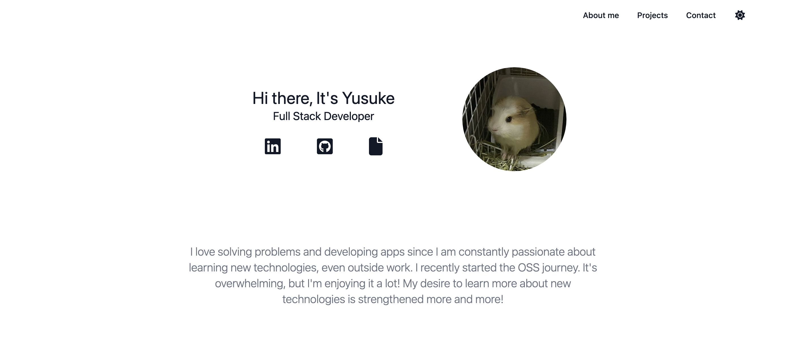
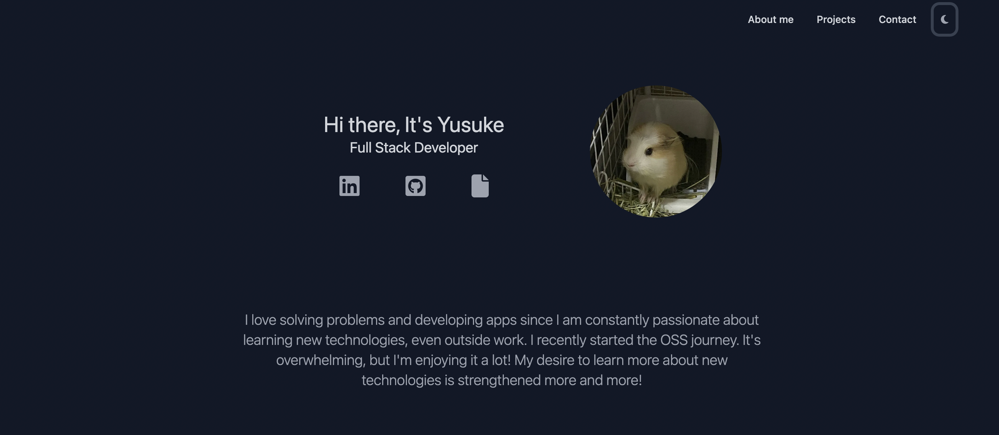

# portfolio

<h2>This is my portfolio site.</h2>






# Live project 
https://yk-jp-portfolio.vercel.app/

# Usage

## Clone repository
 run this command to clone this repository
 ```
 git clone git@github.com:yk-jp/portfolio-v2.git
 ``` 

## Install Dependencies
Run following commands in the root folder
```
npm install 
```

## Start app
Run following commands and open http://localhost:3000 in your browser.
```
npm run dev
```

# Tech stack 
*  HTML
*  CSS
*  Tailwind CSS
*  Flowbite
*  Next.js
*  Typescript
